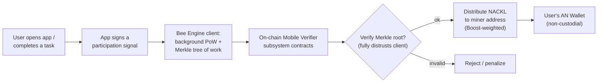
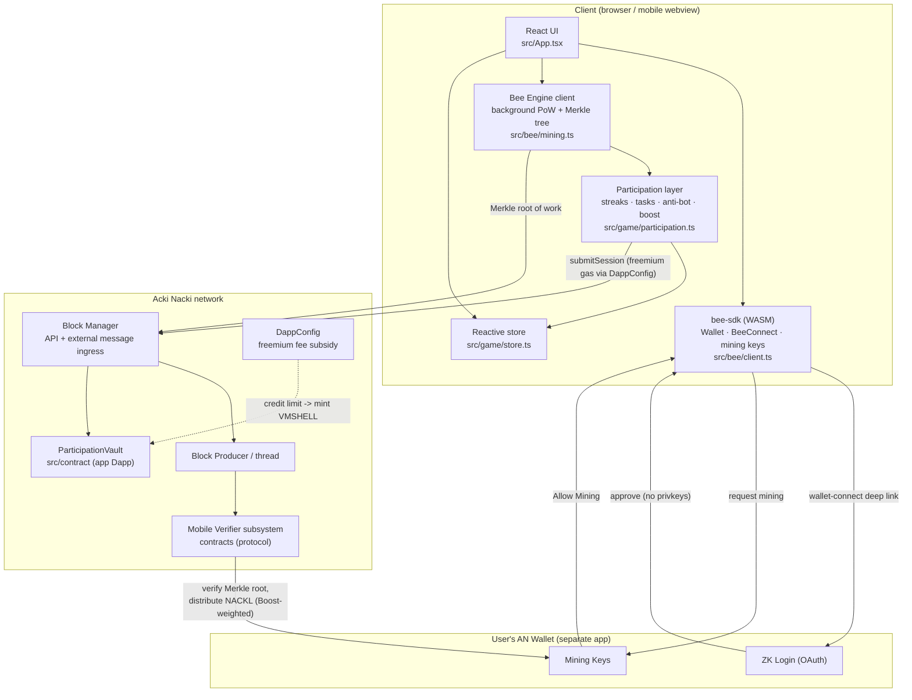
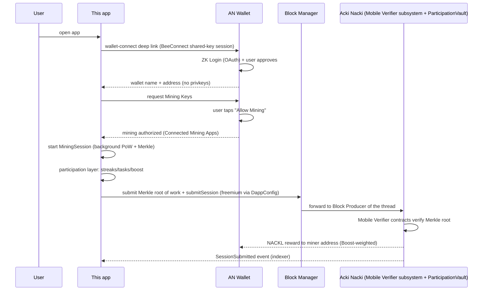
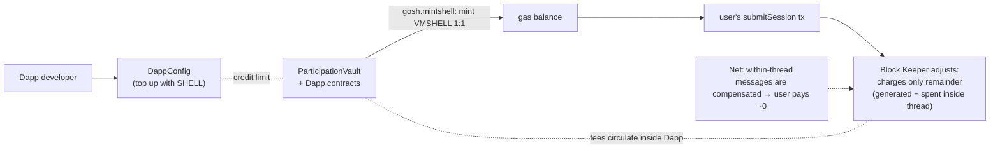

# Acki Nacki — Proof-of-Participation reference app

A reference implementation of a **mobile/web Proof-of-Participation mining app** on the [Acki Nacki](https://ackinacki.com) blockchain, built around the official **Bee Engine** SDK and **TVM SDK**.

This is a **learning/reference scaffold**, not a production product. It shows the full loop end to end: wallet-connect → mining authorization → background Bee Engine mining → participation layer (streaks/tasks/boosts) → on-chain participation record → freemium gas. Every file marks **what is real (from official docs/SDK)** vs **what is illustrative**.

> ⚠️ Nothing here is financial advice. Acki Nacki mainnet is live; NACKL has no TGE/pre-mine/team allocation per the project. Treat all reward math as illustrative.

---

## 1. What Proof-of-Participation (PoP) actually is

Proof-of-Participation is a family of mechanisms where the network rewards **verifiable human activity** instead of computational power or staked capital. The phone does **not** compete with ASICs; it registers participation. There are two sub-families worth distinguishing:

| Family | What the device does | Reward source | Examples |
| --- | --- | --- | --- |
| **Pure participation** (no hashing) | Signs small messages registering activity | Pre-allocated token emission distributed by participation score | Pi Network, Torium, Hype Network |
| **Lightweight client PoW + on-chain verification** (Acki Nacki Bee Engine) | Runs a throttled background PoW, builds a Merkle tree of work | Protocol block rewards, paid only after on-chain verification of the Merkle root | Popit Miner, Entropy, GridHuman, Mining Hub, this demo |

Acki Nacki's approach is the **stronger** one cryptographically: the client really does work (PoW) and the chain **verifies** it, so a client cannot fake rewards. The "participation" layer (Boosts, streaks, reputation) then modulates the miner's share within the on-chain Mobile Verifier reward game — it does not *create* value out of thin air.

### How "clicks in a game" turn into mining (the loop)



The crucial point: **the app never mints tokens itself.** It produces provable work + participation signals; the protocol verifies and pays. That is what separates a legitimate PoP app from a "points in a database" scam.

---

## 2. Existing real apps on Acki Nacki (ideal examples)

The Acki Nacki mainnet ecosystem is live and tracked by [ACKI.PRO](https://acki.pro). Real PoP/Bee-Engine apps already running:

| App | What it is | PoP angle |
| --- | --- | --- |
| **Popit Music** | AI music generation + NACKL mining | Connect AN Wallet, authorize Mining Keys, mine while creating/using. The official "Connecting an AN Wallet and Setting Up Mining Keys" guide uses Popit Music as the worked example. |
| **Popit Miner / Popit Games / Popit Game (Steam)** | Roguelike card game; Popits are user-generated cards | "Tap and mine NACKL with your phone"; mining-flavoured gameplay tied to the ecosystem. |
| **Entropy** | Desktop app | "Click a button, start mining. Collects hardware entropy while you use your PC — music, documents, movies, browsing. The more active your PC, the higher the reward." |
| **GridHuman** | AI-driven mining app | "Open the app — mining starts. The AI handles timing, epochs, and submissions. Mining Skill Score, leaderboards, missions, daily streaks, Districts." |
| **Mining Hub (EugeneDAO)** | Play games → earn mining hours | "Play games, earn mining hours, and let the app mine around the clock in the background." |
| **Pocket Miner** | Telegram mini-app | Lightweight Telegram-based miner. |
| **Popit clicker** | Browser extension | Brave/Chrome addon that enables mining while visiting the Popit mining app. |
| **DEX.DO** | On-chain DEX | "Points & Rewards" incentive program — participation rewards for meaningful protocol use (a non-mining PoP variant). |

All of them share the same plumbing this repo demonstrates: AN Wallet + Mining Keys + Bee Engine + freemium Dapp.

### How the official two-step setup works (from the docs)

1. **Wallet Authentication** — scan a QR / open a deep link in AN Wallet, approve. App receives wallet name + address. **No private keys or seed phrase shared.**
2. **Mining Authorization** — a *separate* approval that grants the app **Mining Keys** (dedicated keys for NACKL mining, distinct from wallet ownership keys). Manageable/revocable anytime in `AN Wallet → Settings → Connected Mining Apps`.

AN Wallet uses **ZK Login** (Google/Apple OAuth via a zero-knowledge proof), so most users never handle a seed phrase.

---

## 3. Architecture of this reference app



### Component responsibilities

- **`src/bee/client.ts`** — boots the bee-sdk WASM, builds the `Wallet` client, starts the `BeeConnect` shared-key session (produces the deep link/QR), and resolves the miner (Mobile Verifier) address bound to a wallet name.
- **`src/bee/mining.ts`** — a `MiningSession` that drives the background mining loop and emits sealed work batches `{id, sealedAt, hashes, bestDifficulty, merkleRoot}`. (Simulated cadence; the real "drive a miner" SDK surface is upstream "under development".)
- **`src/game/participation.ts`** — the PoP glue: daily streaks, tasks, light anti-bot heuristics, and a `boostMultiplier` that mirrors the on-chain "Boosts" idea.
- **`src/game/store.ts`** — tiny `useSyncExternalStore`-based reactive store.
- **`src/contract/vaultClient.ts`** — TVM-SDK bridge to the on-chain `ParticipationVault` (`abi.encode_message_body` → `processing.send_message`, get-methods, GraphQL). Scaffolded against the documented module surface.
- **`src/contract/ParticipationVault.sol`** — TVM Solidity contract recording each miner's daily participation (streak/boost/weight), idempotent per day, with a `SessionSubmitted` event for indexers.
- **`src/contract/DappConfig.sol`** — the freemium fee-subsidy service contract (one per Dapp ID) that lets the Dapp's contracts mint VMSHELL gas from a credit limit, so users pay no gas.
- **`src/App.tsx`** — the UI that walks the four phases: `disconnected → wallet-connected → mining-authorized → mining`.

### End-to-end sequence



### Why the user pays no gas (freemium)



---

## 4. The two-token model (why this works economically)

| Token | Role | Behavior |
| --- | --- | --- |
| **NACKL** | Network security / staking / mining reward | Fixed 10.4 B supply, emission by a known saturation curve. **Only mined as block rewards** — no TGE, no pre-mine, no team allocation. Accumulates value. |
| **SHELL** | Computation / gas | Purchased externally; price designed to **not increase** (only decrease, then correct). Keeps gas cheap. **VMSHELL** is the nanotoken unit actually consumed as gas. |

Separating security (NACKL, appreciating) from usage (SHELL, stable/cheap) is the core design that lets a freemium PoP app exist: users mine a *valuable* token without paying volatile gas.

---

## 5. Run it

```bash
cd acki-nacki-pop-miner
npm install
npm run dev      # http://localhost:5173
npm run typecheck
```

Requirements: a modern browser with SharedArrayBuffer (the COOP/COEP headers are set in `vite.config.ts`), and the **AN Wallet** app installed for the real wallet-connect + mining-authorization steps. On Shellnet you can get test tokens via the "Get Test Tokens in Shellnet" guide on the dev portal.

The demo runs in **simulated mode** by default (network = `shellnet`, mining loop simulated). To go live:

1. Register an **App ID** with the Bee infra backend and replace `APP_ID` in `src/bee/client.ts`.
2. Deploy `ParticipationVault` + the canonical `DappConfig` (via the "Dapp ID Full Guide" + TVM-CLI), put the vault address into `VAULT_ADDRESS` in `src/App.tsx`.
3. Wire `connect.wait_wallet_hello(...)` in `src/bee/client.ts` to complete the real wallet-connect round trip (currently the deep link is surfaced for the QR UI).
4. Swap the simulated `MiningSession` loop for the real bee-sdk "drive a miner" calls when the Bee Engine SDK Integration API ships.

---

## 6. What is real vs illustrative

**Real (from official Acki Nacki docs / npm SDK):**
- Bee Engine two-component architecture (client PoW+Merkle ↔ on-chain Mobile Verifier subsystem that distrusts the client). Source: `dev.ackinacki.com/bee-engine/bee-engine-overview`.
- bee-sdk API surface: `init`, `Wallet`, `BeeConnect.create_shared_key_session`, `get_miner_address_by_wallet_name`, `deploy_multisig_via_giver`, `multisig_balances`, currency ids (1=NACKL, 2=SHELL, 3=USDC). Source: `@teamgosh/bee-sdk` npm README.
- TVM SDK modules (`abi`, `net`, `processing`, `client`, `boc`, `crypto`). Source: `dev.ackinacki.com` SDK reference.
- Two-token model, Mobile Verifier role + Boost reward game, freemium/DappConfig fee-factory, Solidity-on-TVM, Dapp ID, four-phase consensus, ZK Login. Sources: `docs.ackinacki.com` (Overview, Tokenomics, Fee System, Network Architecture, Smart Contracts) + dev portal.
- The two-step "Wallet Authentication / Mining Authorization" flow and Mining Keys. Source: "Connecting an AN Wallet and Setting Up Mining Keys".
- The list of live ecosystem apps. Source: `acki.pro`.

**Illustrative (this repo's design — sensible, not official spec):**
- The exact `ParticipationVault` / `DappConfig` Solidity (TVM-Solidity dialect details to finalize against the TVM-Solidity-Compiler ≥ 0.81).
- The participation-layer weights (streak/task/anti-bot/boost formulas).
- The simulated `MiningSession` PoW cadence and `pseudoMerkleRoot`.
- The exact TVM-SDK call signatures in `vaultClient.ts` (scaffolded to the documented module surface; pin to installed typings).

---

## 7. Project layout

```
acki-nacki-pop-miner/
  package.json, vite.config.ts, tsconfig.json, index.html
  src/
    main.tsx
    App.tsx                  # orchestrator + UI
    bee/
      client.ts              # bee-sdk boot, Wallet, BeeConnect, miner address
      mining.ts              # background MiningSession (PoW + Merkle batches)
    game/
      participation.ts       # streaks, tasks, anti-bot, boost
      store.ts               # reactive store
    contract/
      vaultClient.ts         # TVM-SDK bridge to ParticipationVault
      ParticipationVault.sol # on-chain participation record (TVM Solidity)
      DappConfig.sol         # freemium fee-subsidy service contract
    abi/
      participation.abi.json
```

## 8. Sources

- Acki Nacki docs: https://docs.ackinacki.com (Overview, Synchronization & Consensus, Tokenomics, Fee System, Network Architecture, Smart Contracts, "Connecting an AN Wallet and Setting Up Mining Keys")
- Developer portal: https://dev.ackinacki.com (Bee Engine Overview, Dapp ID Full Guide, SDK reference, GraphQL)
- bee-sdk: https://www.npmjs.com/package/@teamgosh/bee-sdk · repo https://github.com/gosh-sh/bee-engine
- TVM SDK: https://github.com/tvmlabs/tvm-sdk · examples https://github.com/tvmlabs/sdk-examples
- Ecosystem radar: https://acki.pro
- Mainnet explorer (GraphQL): https://mainnet.ackinacki.org/graphql · Testnet: https://shellnet.ackinacki.org/graphql
